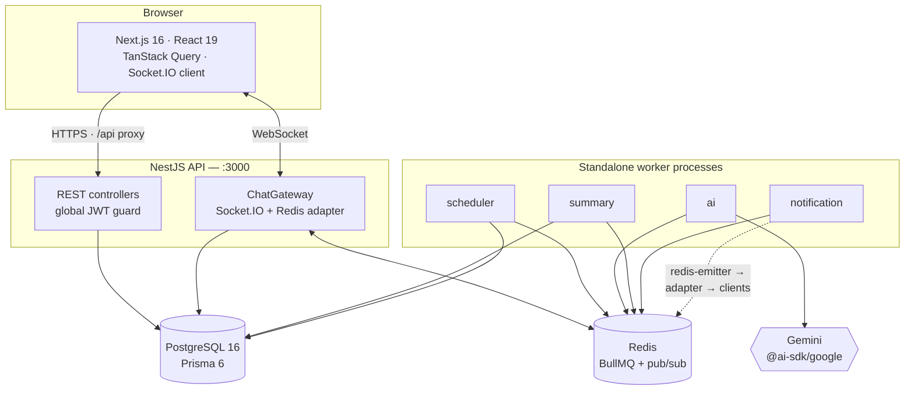
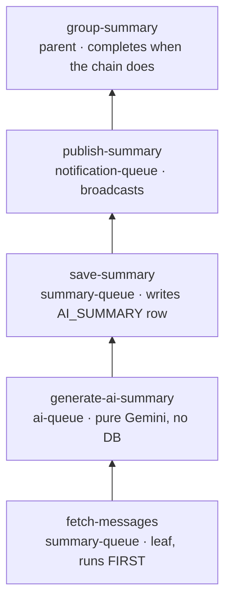

<p align="center">
  
</p>

<h1 align="center">Convo</h1>

<p align="center">
  <b>Real-time group chat with AI daily summaries.</b><br>
  A full-stack monorepo built across five architectural phases — REST → Polling → WebSockets → Background Jobs → Distributed Systems.
</p>

<p align="center">
  
  
  
  
  
  
  
  
</p>

---

Convo is a group chat application where every architectural decision is deliberate and written
down. It runs a NestJS API, a Next.js client, four standalone BullMQ workers, Postgres and Redis —
and the interesting part is not that it works, but *why each piece is shaped the way it is*: why
readiness and liveness are separate probes, why the refresh token is opaque and hashed, why the
summary pipeline is a nested BullMQ Flow rather than four flat siblings, why message history uses
keyset pagination instead of `OFFSET`.

All five phases are complete and merged into `main`, plus the bonus features.

## Contents

- [What it does](#what-it-does)
- [Quick start](#quick-start)
- [Architecture](#architecture)
- [Tech stack](#tech-stack)
- [Repository layout](#repository-layout)
- [Configuration](#configuration)
- [HTTP API](#http-api)
- [WebSocket API](#websocket-api)
- [Design notes](#design-notes)
- [Testing](#testing)
- [Troubleshooting](#troubleshooting)
- [Further reading](#further-reading)

---

## What it does

| | Feature | Notes |
|---|---|---|
| 🔐 | **Auth** | Email/password (argon2id) + Google sign-in. Short-lived JWT access token, opaque rotating refresh token with reuse detection |
| 👥 | **Groups** | Create, join, leave, transfer ownership, member list with roles |
| 💬 | **Messaging** | Send, edit, soft-delete, cursor-paginated history, case-insensitive search |
| ⚡ | **Real-time** | Socket.IO with a Redis adapter — new messages, edits, reactions, typing, presence, read receipts |
| 😀 | **Reactions** | One-tap emoji toggle; the server decides add vs. remove |
| 📎 | **Attachments** | Images and PDFs, ≤5 MB, validated by magic bytes. Supabase Storage or local disk, chosen at runtime |
| 🤖 | **AI summaries** | Gemini writes a daily digest per active group, delivered as a normal chat message |
| 🧵 | **Distributed** | Four standalone worker processes draining four BullMQ queues, coordinated by a BullMQ Flow |
| ❤️ | **Ops** | Separate liveness/readiness probes, startup config validation, structured error envelope |

---

## Quick start

**Prerequisites:** Node.js 20+, Docker Desktop.

### The one-command path (Windows / PowerShell)

```powershell
git clone https://github.com/asimrazadev10/Internship-Project.git
cd "Internship-Project"

# copy the two env files and fill in the blanks (see Configuration)
copy backend\.env.example backend\.env
copy frontend\.env.example frontend\.env.local

npm --prefix backend install
npm --prefix frontend install

.\dev.ps1
```

`dev.ps1` brings the entire system up in dependency order: Docker services → pending migrations →
API + four workers + frontend, with colour-coded prefixed output in one terminal. Ctrl-C stops all
of them together.

| Flag | Effect |
|---|---|
| `-NoWorkers` | Chat only; AI summaries are not generated |
| `-Prod` | Run the compiled API (`start:prod`) instead of watch mode — lower memory |
| `-SkipMigrate` | Skip `prisma migrate deploy` |
| `-Clean` | Delete `frontend/.next` and `backend/dist` first; use after a force-killed run |
| `-Down` | Stop the Docker services and exit |

> **Why a script rather than a `concurrently` one-liner:** the workers run from `backend/dist`, and
> `nest start --watch` **deletes** `dist/` on startup (`deleteOutDir: true`). Started together, the
> workers lose the race and die with `Cannot find module './scheduler-worker.module'`. `dev.ps1`
> holds them back until the API's port opens, which proves the compile finished. It also probes
> Postgres/Redis with a TCP socket rather than `docker ps`, because a wedged Docker CLI says nothing
> about whether the database is reachable.

### Manual path (any OS)

```bash
# 1. Postgres + Redis
docker compose up -d

# 2. Backend
cd backend
npm install
cp .env.example .env          # fill in JWT secrets + GOOGLE_GENERATIVE_AI_API_KEY
npx prisma migrate deploy
npm run start:dev             # API on :3000

# 3. Workers (new terminal, from backend/)
npm run workers:all           # all four; or worker:scheduler / worker:ai / worker:summary / worker:notification

# 4. Frontend (new terminal)
cd frontend
npm install
cp .env.example .env.local
npm run dev                   # app on :3001
```

| Service | URL |
|---|---|
| Frontend | http://localhost:3001 |
| API | http://localhost:3000 |
| Readiness probe | http://localhost:3000/health/ready |
| Postgres | `localhost:55432` |
| Redis | `localhost:6379` |
| Prisma Studio | `npm --prefix backend run prisma:studio` → http://localhost:5555 |

> **Port note:** Postgres is published on **55432**, not 5432, to avoid colliding with a native
> Postgres install. `DATABASE_URL` and `POSTGRES_PORT` must agree — change both or neither.

---

## Architecture



The frontend never talks to the API cross-origin: Next rewrites `/api/*` to `BACKEND_ORIGIN`, so
there is no CORS preflight on ordinary requests. The WebSocket connects directly, because sockets
do not proxy.

### The AI summary pipeline

Every `SUMMARY_INTERVAL_MS` the scheduler finds groups with activity in the window and builds **one
BullMQ Flow per group** — so a Gemini failure in one group can never block another.



A **nested chain**, not four flat siblings: the stages are strictly sequential and each reads the
previous stage's output via `getChildrenValues()`. Flat siblings under one parent would run in
parallel, which a `fetch → generate → save → publish` pipeline cannot do. `failParentOnFailure`
bubbles any stage failure up so the flow fails cleanly instead of stranding the parent in
waiting-children.

Because `publish` runs in a **different process** from the API that holds the Socket.IO connections,
it cannot call `server.emit()`. It publishes through **`@socket.io/redis-emitter`** onto the same
Redis pub/sub channels the API's **`@socket.io/redis-adapter`** subscribes to — so the broadcast
crosses the process boundary and reaches clients exactly like any other socket event.

Every job and its parent/child dependency state lives in Redis, not in worker memory. You can run
the four workers **one at a time**, Ctrl-C between each, and the summary still completes in the
correct order — that durability is the whole point.

---

## Tech stack

<table>
<tr><th align="left">Backend</th><th align="left">Frontend</th></tr>
<tr valign="top"><td>

| Layer | Choice |
|---|---|
| Framework | NestJS 11 |
| Database | PostgreSQL 16 |
| ORM | Prisma 6 |
| Cache / queues | Redis + BullMQ 5 |
| Real-time | Socket.IO 4.8 + Redis adapter |
| Validation | class-validator / class-transformer |
| Hashing | argon2id |
| AI | Gemini via `@ai-sdk/google` (Vercel AI SDK) |

</td><td>

| Layer | Choice |
|---|---|
| Framework | Next.js 16 (App Router, Turbopack) |
| UI | React 19 |
| Server state | TanStack Query 5 |
| HTTP | axios (with `/api` rewrite proxy) |
| Real-time | socket.io-client 4.8 |
| Styling | Tailwind CSS 4 |
| Language | TypeScript 5 |

</td></tr>
</table>

---

## Repository layout

```
├── backend/                  NestJS API + workers
│   ├── src/
│   │   ├── config/           env loading + startup validation
│   │   ├── common/           filters, interceptors, guards, decorators, pipes, DTOs
│   │   ├── prisma/           PrismaService + module
│   │   ├── auth/             register/login/refresh/logout/google, JWT strategy, rotation
│   │   ├── users/            user persistence + serialization
│   │   ├── groups/           groups, membership, join/leave/transfer
│   │   ├── messages/         create, edit, delete, history, search, reactions
│   │   ├── chat/             ChatGateway, WS auth middleware, room + event contract
│   │   ├── notifications/    cross-process broadcast via redis-emitter
│   │   ├── summary/          per-stage BullMQ processors + Flow producer
│   │   ├── ai/               Gemini wrapper — vendor isolated behind one interface
│   │   ├── queues/           queue names and job constants
│   │   ├── health/           liveness + readiness probes
│   │   └── workers/          four standalone worker entry points
│   └── prisma/               schema.prisma + versioned migrations
├── frontend/                 Next.js app
│   └── src/
│       ├── app/              App Router: (auth)/login, (auth)/register, groups/[id]
│       ├── components/       auth, groups, messages, ui
│       └── lib/              api clients, auth context, TanStack queries, socket layer
├── docs/                     learning notes, design specs, study guide
├── scripts/wait-for-port.js  dependency-free port gate used by dev.ps1
├── docker-compose.yml        Postgres + Redis
└── dev.ps1                   one-command dev runner
```

### Data model

Six models: `User`, `Group`, `GroupMember`, `Message`, `Reaction`, `RefreshToken`.

Notable choices: **UUIDv7** primary keys (`uuid(7)` + `@db.Uuid`) so ids sort by creation time and
index locality stays good; `Message` carries `type` (`USER` / `SYSTEM` / `AI_SUMMARY`) with a
nullable `senderId`, so **an AI summary is just a message** with no human sender — it needs zero new
transport code to reach clients; and `@@index([groupId, createdAt, id])` exists specifically so the
keyset pagination cursor resolves inside the index instead of touching heap rows.

---

## Configuration

Config is **validated at startup** — the app refuses to boot on a missing or malformed value rather
than failing later on the first request that needs it.

<details open>
<summary><b><code>backend/.env</code></b> — copy from <code>.env.example</code></summary>

| Variable | Purpose | Default |
|---|---|---|
| `PORT`, `NODE_ENV` | App | `3000`, `development` |
| `POSTGRES_USER`, `POSTGRES_PASSWORD`, `POSTGRES_DB`, `POSTGRES_PORT` | Consumed by `docker-compose.yml` | `chatuser`, `chatpass`, `chatdb`, `55432` |
| `DATABASE_URL` | Postgres connection — port must match `POSTGRES_PORT` | — |
| `JWT_ACCESS_SECRET`, `JWT_REFRESH_SECRET` | **Different** secrets, so a leaked access secret cannot mint refresh tokens | — (required) |
| `JWT_ACCESS_EXPIRES_IN`, `JWT_REFRESH_EXPIRES_IN` | Token lifetimes | `15m`, `7d` |
| `GOOGLE_CLIENT_ID` | The `audience` a Google ID token must carry | — |
| `REDIS_HOST`, `REDIS_PORT`, `REDIS_PASSWORD` | Queues + socket pub/sub | `localhost`, `6379` |
| `GOOGLE_GENERATIVE_AI_API_KEY` | Free AI Studio key | — (required for summaries) |
| `GEMINI_MODEL` | Model id | `gemini-3.5-flash` |
| `SUMMARY_INTERVAL_MS`, `SUMMARY_WINDOW_MS` | Tick frequency and lookback | `86400000` (24h) |
| `AI_RATE_LIMIT_MAX`, `AI_RATE_LIMIT_DURATION_MS` | Global Gemini cap, enforced by a Redis-coordinated limiter across *all* ai-worker instances | `10`, `60000` |
| `TOKEN_PURGE_INTERVAL_MS`, `REFRESH_TOKEN_PURGE_GRACE_MS` | Refresh-token housekeeping | `86400000`, `604800000` |
| `SOCKET_CORS_ORIGIN` | Allowed WebSocket origin | `http://localhost:3001` |
| `*_WORKER_CONCURRENCY` | Per-process job concurrency for each of the four workers | `1` / `10` / `5` / `3` |
| `SUPABASE_URL`, `SUPABASE_SERVICE_KEY`, `SUPABASE_BUCKET` | **Optional** — uploads fall back to local disk when unset | — |

Generate the JWT secrets with `openssl rand -base64 48`. Get a free Gemini key at
[aistudio.google.com/apikey](https://aistudio.google.com/apikey) (the Generative Language API tier
used by `@ai-sdk/google` — **not** paid Vertex AI).

</details>

<details>
<summary><b><code>frontend/.env.local</code></b> — copy from <code>.env.example</code></summary>

| Variable | Purpose |
|---|---|
| `BACKEND_ORIGIN` | Where Next rewrites `/api/*`. **Server-only** — no `NEXT_PUBLIC_` prefix, so it never reaches client bundles |
| `NEXT_PUBLIC_SOCKET_URL` | Backend origin for the WebSocket — direct, because sockets don't proxy |
| `NEXT_PUBLIC_GOOGLE_CLIENT_ID` | Must equal the backend's `GOOGLE_CLIENT_ID`. The button hides itself if unset |
| `NEXT_PUBLIC_SITE_URL` | Public origin of this app, used as `metadataBase` for Open Graph. Inlined at **build** time |

</details>

---

## HTTP API

Every response shares one envelope:

```jsonc
// success
{ "success": true, "data": { }, "message": "…", "meta": { } }

// failure
{ "success": false, "error": { "code": "…", "message": "…", "details": [ ] } }
```

Every route is protected by a **global JWT guard**; public routes opt out with `@Public()`.

### Health — public

| Method | Path | Notes |
|---|---|---|
| `GET` | `/health` | Liveness — touches nothing, cannot flap |
| `GET` | `/health/ready` | Readiness — pings Postgres and Redis; `503` if either is down |

Two probes, not one, because they answer different questions. Liveness asks *"should this process be
restarted?"*; readiness asks *"can it serve traffic right now?"*. A liveness probe that checked the
database would restart a healthy process during a brief DB blip — turning a partial outage into a
total one and dropping every in-memory WebSocket connection with it.

### Auth — public

| Method | Path | Body | Notes |
|---|---|---|---|
| `POST` | `/auth/register` | `{ email, password, name }` | Returns user + access + refresh |
| `POST` | `/auth/login` | `{ email, password }` | Generic `401` on any failure — never reveals which field was wrong |
| `POST` | `/auth/refresh` | `{ refreshToken }` | Rotates the token; replay revokes the whole family |
| `POST` | `/auth/logout` | `{ refreshToken }` | **Requires** an access token; revokes that session |
| `POST` | `/auth/google` | `{ idToken }` | Verifies Google's ID token, issues our own JWT |

### Groups — `Authorization: Bearer <access token>`

| Method | Path | Notes |
|---|---|---|
| `POST` | `/groups` | Create; the creator becomes `OWNER` |
| `GET` | `/groups` | Groups the caller belongs to, with member/message counts |
| `GET` | `/groups/:id` | Detail + members — **members only** |
| `POST` | `/groups/:id/join` | Join by id |
| `POST` | `/groups/:id/read` | Mark read up to now — **members only** |
| `POST` | `/groups/:id/leave` | Leave — **members only** (ownership rules in [Design notes](#design-notes)) |
| `POST` | `/groups/:id/transfer-ownership` | `{ userId }` — **owner only** |

### Messages — all **members only**

| Method | Path | Notes |
|---|---|---|
| `POST` | `/groups/:id/messages` | `{ content }` |
| `GET` | `/groups/:id/messages?limit=&cursor=` | History, newest first, keyset-paginated |
| `GET` | `/groups/:id/messages/search?q=` | Case-insensitive substring, newest first, hard-capped |
| `POST` | `/groups/:id/messages/upload` | Multipart: `file`, optional `content` caption |
| `PATCH` | `/groups/:id/messages/:messageId` | Edit — own `USER` messages only |
| `DELETE` | `/groups/:id/messages/:messageId` | Soft delete — the row stays so history renders a placeholder |
| `POST` | `/groups/:id/messages/:messageId/reactions` | `{ emoji }` — one endpoint toggles add/remove |

### Summaries

| Method | Path | Notes |
|---|---|---|
| `POST` | `/summaries/run` | Enqueue the scheduler job immediately → `202 { "enqueued": true }`. Useful for demos instead of waiting 24h |

---

## WebSocket API

The socket handshake is authenticated by the same access token; identity is taken from the verified
token on the server, **never** from the client payload. Each group is one Socket.IO room,
`group:<groupId>`.

<table>
<tr><th align="left">Client → server</th><th align="left">Server → client</th></tr>
<tr valign="top"><td>

| Event | Purpose |
|---|---|
| `join_group` | Subscribe to a group's room |
| `leave_group` | Unsubscribe |
| `send_message` | Post a message over the socket |
| `typing_start` | Begin typing indicator |
| `typing_stop` | End typing indicator |

</td><td>

| Event | Purpose |
|---|---|
| `new_message` | A message was posted (**including AI summaries**) |
| `message_updated` | Edited or soft-deleted |
| `reaction_updated` | The full reaction set for a message |
| `member_joined` / `member_left` | Membership changed |
| `owner_changed` | Ownership transferred or auto-promoted |
| `read_receipt` | Someone's read cursor advanced |
| `user_typing` | Typing indicator |
| `presence` | Who is currently online in the room |

</td></tr>
</table>

These names are a **cross-process contract** with three consumers that no compiler checks:
`ChatGateway`, `NotificationPublisher` (in a worker with no Socket.IO server at all), and
`frontend/src/lib/socket/socket-events.ts`. A typo fails *silently* — the emit succeeds, no handler
is registered, and an AI summary published to `new_mesage` is simply never delivered while the job
still reports success. They live in one file (`backend/src/chat/chat.constants.ts`) so a rename is a
compile error rather than a grep across two codebases.

Leaving a group also **evicts that user's live sockets** from the room. Sockets join on `join_group`
and nothing else removes them, so without this a departed member would keep receiving messages until
they happened to disconnect.

---

## Design notes

<details>
<summary><b>Authentication model</b></summary>

- **Access token** — short-lived JWT, verified by signature alone, no database round trip.
- **Refresh token** — long-lived *opaque* random string; only its **SHA-256 hash** is stored, so a
  database leak yields nothing usable. A slow hash (argon2/bcrypt) would buy nothing here: the token
  is already high-entropy, so there is no low-entropy secret to brute-force — only latency on a hot
  path. Passwords, which *are* low-entropy, use **argon2id**.
- **Rotation with reuse detection** — every refresh issues a new token in the same family and revokes
  the old one. Presenting an already-revoked token means it leaked, so the entire family is revoked.
- **Google sign-in is a token exchange, not a session** — the frontend obtains a Google ID token and
  POSTs it to `/auth/google`; the backend verifies signature, audience, issuer and `email_verified`,
  then issues *its own* JWT. Google's token is never used as a session credential.
- Expired refresh rows are purged by a scheduled job. Only **expired** rows, never merely revoked
  ones — reuse detection works by finding a revoked row that still exists.

</details>

<details>
<summary><b>Keyset pagination</b></summary>

History uses keyset (cursor) pagination, not `OFFSET`. Request `?limit=20`; `meta.nextCursor` is an
opaque token to pass back as `?cursor=…`, and `meta.hasMore` is `false` on the last page.

The predicate is a row-value comparison `(createdAt, id) < (cursor.createdAt, cursor.id)`, written
as the equivalent `OR` form because Prisma has no tuple-comparison operator. It resolves entirely
within `@@index([groupId, createdAt, id])`, making it **O(log n) at any depth** — unlike `OFFSET`,
which scans and discards, and unlike a `createdAt`-only cursor, which skips or repeats rows sharing
a timestamp. One extra row is fetched (`take: limit + 1`) purely to learn whether another page
exists, avoiding a second `COUNT`.

</details>

<details>
<summary><b>Leaving and ownership</b></summary>

A group can never be left ownerless, so `POST /groups/:id/leave` behaves differently by caller:

| Caller | Others remain? | Result |
|---|---|---|
| Member | — | Their membership row is deleted |
| Owner | yes | The **longest-standing** remaining member is promoted, then the caller leaves |
| Owner | no | The **group is deleted**, and its messages cascade with it |

The response says which happened: `{ left, groupDeleted, newOwnerId }`.

The owner check in `transfer-ownership` runs **inside the database transaction**, not in a guard — a
guard runs before the transaction opens, so two concurrent transfers could both pass it and leave the
group with two owners.

`Group.createdBy` is never reassigned. It records who *created* the group and is half of the
`@@unique([createdBy, name])` constraint; moving it could collide with a group the new owner already
has under that name.

**Join model.** Any authenticated user holding a group's id may join. Ids are unguessable UUIDv7
values, so the id acts as a weak capability token shared out of band. Invite tokens with expiry are
the natural next step and are intentionally out of scope.

</details>

<details>
<summary><b>File uploads and the rewritten filename</b></summary>

Images and PDFs only, 5 MB max, enforced by `ParseFilePipe` *before* the handler runs — validation
inspects the actual **bytes**, not the declared type. Two storage backends are chosen at runtime with
no code change:

| | When | Bytes go to | URL returned |
|---|---|---|---|
| **Supabase Storage** | `SUPABASE_URL` + `SUPABASE_SERVICE_KEY` set | Supabase bucket via the Storage REST API | Absolute public URL |
| **Local disk** | either unset | `backend/uploads/<groupId>/` | `/api/uploads/…` via the Next proxy |

The fallback exists so uploads work on a fresh clone with no external account. The service-role key
is server-side only and never reaches the browser.

> **Why the stored filename is rewritten.** The extension is derived from the *validated MIME type*,
> never from the uploader's filename. Express serves static files with a `Content-Type` taken from the
> **extension**, while validation checked the **bytes** — so preserving a user-supplied extension
> would let a real PNG named `evil.html` come back as `text/html` from the app's own origin. That is
> stored XSS with the access token in `localStorage`. Local uploads are additionally served with
> `nosniff` and a `sandbox` CSP.

</details>

<details>
<summary><b>Running and demoing the AI pipeline</b></summary>

All four workers must be running for summaries to be generated and broadcast — the API process runs
no summary stage itself.

```bash
npm run worker:scheduler      # scheduler-queue — the repeatable tick, builds one Flow per active group
npm run worker:ai             # ai-queue — pure Gemini, needs no DB access
npm run worker:summary        # summary-queue — fetch-messages, save-summary, group-summary parent
npm run worker:notification   # notification-queue — publish-summary
npm run workers:all           # all four in one terminal
```

To demo without waiting a day, either set `SUMMARY_INTERVAL_MS=60000` and restart the scheduler, or:

```bash
curl -X POST http://localhost:3000/summaries/run -H "Authorization: Bearer <ACCESS_TOKEN>"
#  → 202 { "data": { "enqueued": true } }
```

Send a few messages in a group first, then trigger. An `AI_SUMMARY` card appears in that group's chat
live, over the same `new_message` broadcast as any other message. Groups with no new messages in the
window, or already summarized for it, are skipped.

**Durable hand-off demo.** Because state lives in Redis, run the stages one at a time and Ctrl-C
between each — the summary still completes in order even though the workers were never alive
simultaneously. This is also the memory-light way to demo on a small machine.

</details>

---

## Testing

```bash
docker compose up -d          # Postgres must be running
cd backend && npm run test:e2e
```

End-to-end tests cover the full auth flows (including refresh rotation and reuse detection), Google
sign-in with only Google's token verification stubbed, the membership authorization boundary, and
cursor pagination. Unit tests sit beside the code as `*.spec.ts`.

Other quality gates, from `backend/`:

```bash
npm run lint          # eslint, reports only        npm run lint:fix
npm run format:check  # prettier, check only        npm run format
npm run build         # compile to dist/
```

The frontend exposes `npm run lint` and `npm run build`. Run these **one at a time** rather than
chained — see [Troubleshooting](#troubleshooting).

---

## Troubleshooting

| Symptom | Cause and fix |
|---|---|
| `dev.ps1` exits with *"port 3000/3001 is already in use"* | A previous run is still alive. Ctrl-C it, or `Stop-Process -Id <pid> -Force` using the PIDs the script prints. It aborts deliberately rather than failing 40s later on `EADDRINUSE` |
| Workers die with `Cannot find module './scheduler-worker.module'` | They started before `dist/` was rebuilt. Run through `dev.ps1`, which gates them on the API's port, or `npm run build` first |
| Every page 404s but the server responds | A force-killed `next dev` left `.next` in a bad state. `.\dev.ps1 -Clean` |
| `JavaScript heap out of memory` during build or lint | Run `tsc`, `eslint` and `next build` **one at a time**, never chained. On a low-RAM machine also avoid running Prisma Studio alongside the full stack |
| Readiness returns 503 | Postgres or Redis is unreachable. `docker compose ps`, then check `DATABASE_URL` uses port `55432` |
| Google button missing | `NEXT_PUBLIC_GOOGLE_CLIENT_ID` is unset — the component hides itself by design |
| `docker compose` hangs | The Docker CLI can wedge under memory pressure while the containers stay healthy. `dev.ps1` bounds every Docker call and probes TCP sockets instead; restart Docker Desktop if it persists |

---

## Further reading

The reasoning behind each phase is written up in `docs/`:

| Path | What's in it |
|---|---|
| [`docs/learning/`](docs/learning) | Phase-by-phase notes, from schema design through backend hardening |
| [`docs/superpowers/specs/`](docs/superpowers/specs) | Design documents written before each phase |
| [`docs/superpowers/plans/`](docs/superpowers/plans) | Implementation plans |
| [`docs/study-guide/`](docs/study-guide) | Interactive guide: REST, polling, WebSockets, background jobs, distributed systems |

---

<p align="center"><sub>Built by <a href="https://github.com/asimrazadev10">Asim Raza</a></sub></p>
